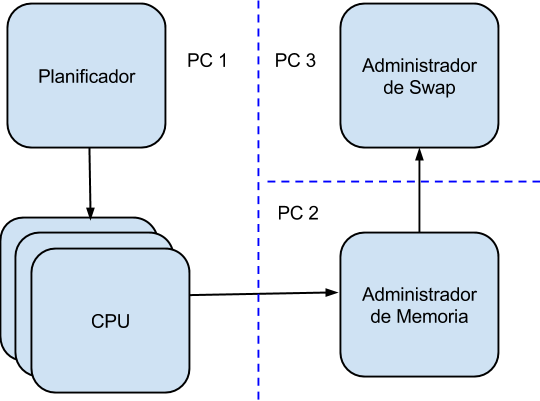

# Arquitectura de Caché 13

El pequeño Sistema Operativo “Cache 13” constará de los siguientes componentes:

Los procesos deberán ser capaces de correr en 3 máquinas diferentes, como muestra el esquema. Al iniciarse, deberán conectarse teniendo en cuenta que los diferentes pedidos se realizarán en el sentido que muestran las flechas.

Nuestro sistema deberá correr pequeños ejecutables, planificarlos en las diferentes CPUs, acceder a memoria a la hora de ejecutarlos y a swap en caso de que el elemento solicitado no esté en memoria principal, emulando el funcionamiento de un Sistema Operativo tradicional.

Para que la evaluación del trabajo práctico sea la adecuada, es muy importante que todos los parámetros que se mencionan como configurables estén en archivos de configuración correspondientes a cada proceso. Esta práctica se debe realizar también para parámetros de entorno tales como IPs, puertos, rutas, etc.

Dado que el Trabajo Práctico se realizará de forma incremental, se recomienda prestar especial atención al diseño de las interfases entre los diferentes elementos de cada proceso. De esta forma, cuando una funcionalidad crezca, la interfase será la misma. Esto es especialmente útil cuando se requiera implementar diferentes algoritmos que realicen la misma tarea de forma distinta.